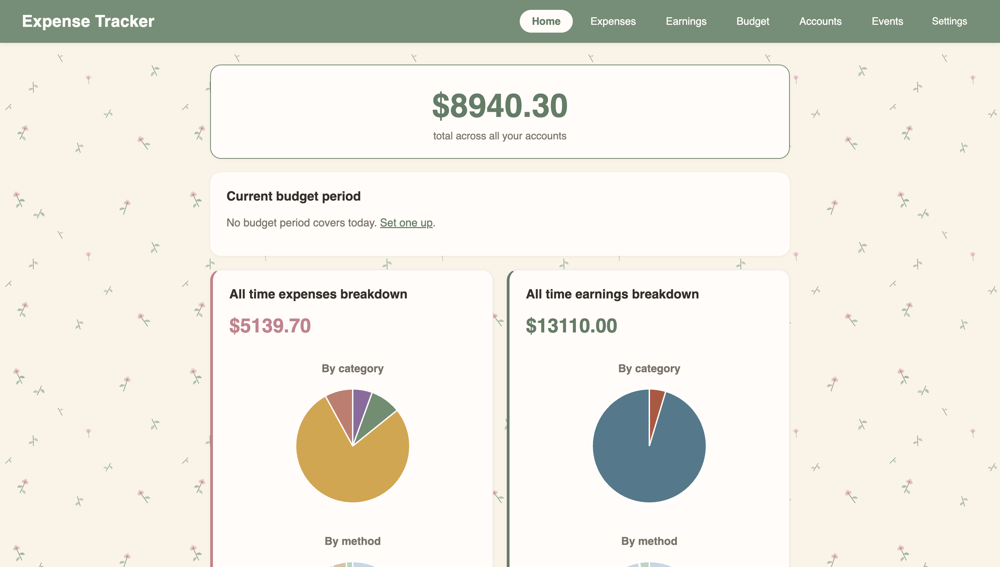
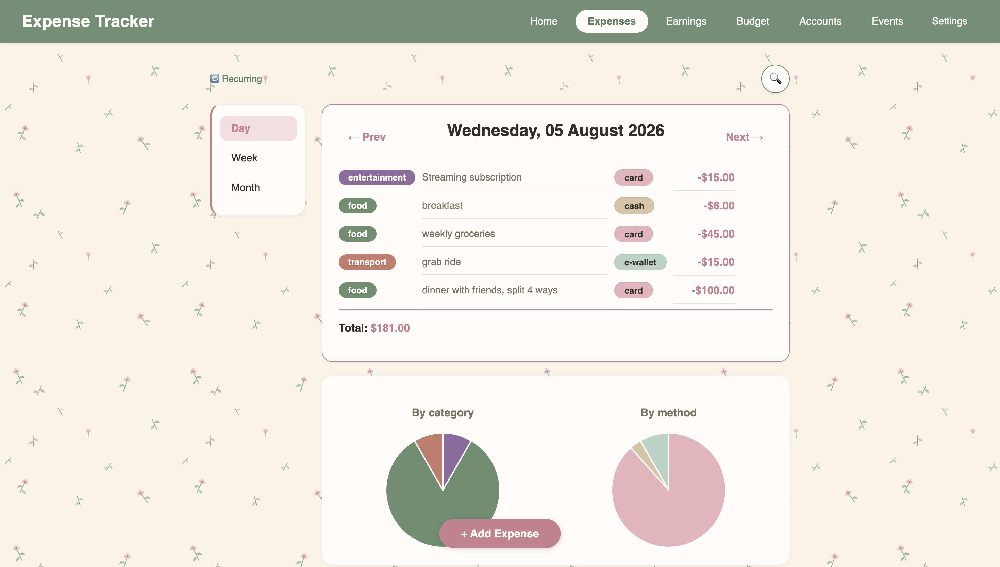
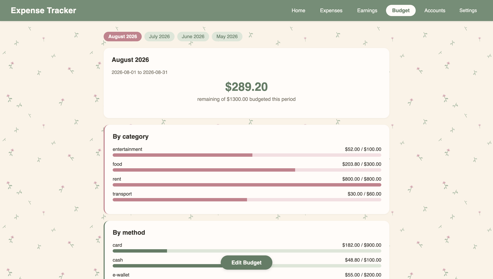
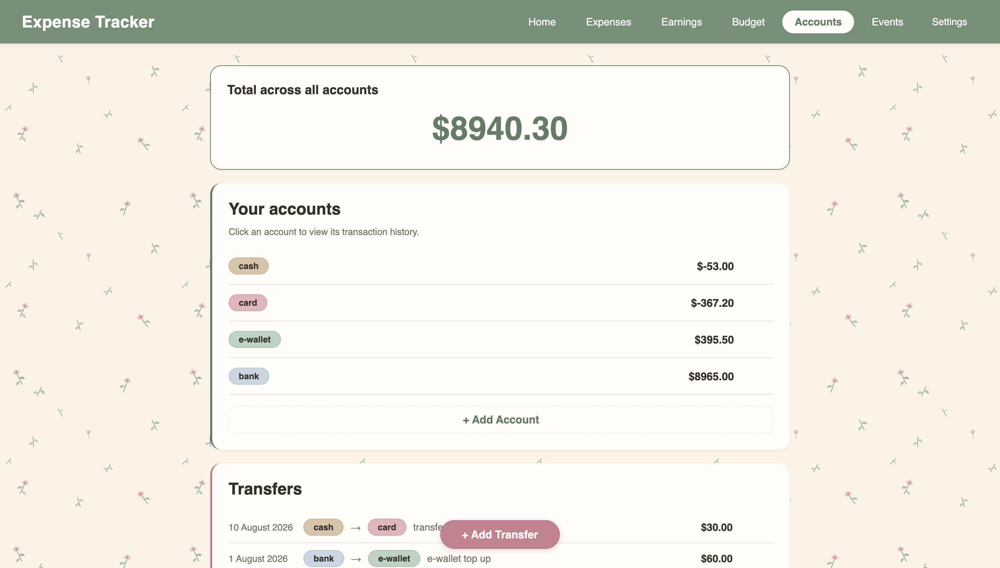
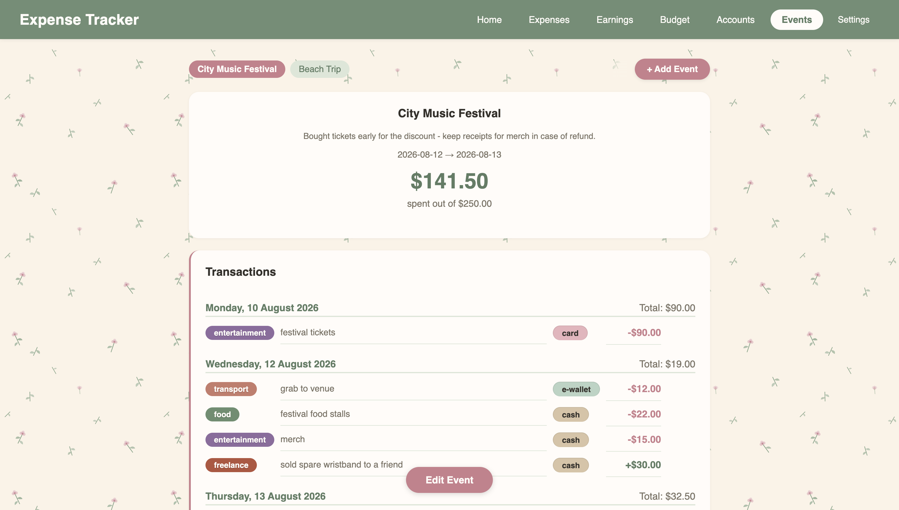

# Expense Tracker

A full-featured expense tracker web application built with Python, Flask, and SQLite for tracking expenses, earnings, budgets, and account balances.

**Live demo:** https://expense-tracker-829k.onrender.com

*Hosted on Render's free tier. The first load may take up to a minute.*


## Features

Track expenses, earnings, budgets, and account balances.

- Add, edit, and delete expenses and earnings
- Daily, weekly, and monthly view
- Organize transactions with customizable categories and payment methods
- Search and filter transactions
- Create recurring expenses and earnings
- View summaries through charts and trends
- Create and manage budget periods with category and method allocations
- Manage multiple accounts and transfer funds between accounts
- View transaction history of each account
- Group transactions into events with a date range and optional budget (transactions within the range are tagged automatically)
- Configurable currency in settings


## Tech Stack

- Python, Flask, Jinja2
- SQLite
- HTML/CSS


## How to Run Locally

Requires Python 3.9+ and pip.
 
```
git clone https://github.com/jenevievejess/expense-tracker.git
cd expense-tracker
pip install -r requirements.txt
python3 app.py
```
 
Then visit http://127.0.0.1:5000
 
To try it with sample data: run `python3 seed_dummy_data.py`


## Project Structure

```
expense-tracker/
├── app.py               Flask routes
├── expenses.py          Expense CRUD + totals
├── earnings.py          Earning CRUD + totals
├── labels.py            Categories & payment methods
├── budget.py            Budget periods & allocations
├── accounts.py          Account balances
├── transfers.py         Transfers between accounts
├── recurring.py         Recurring transactions
├── events.py            Events & date-range auto-tagging
├── trends.py            Monthly totals for charts
├── search.py            Search
├── settings.py          Currency setting
├── reports.py           Home page summary
├── dateutils.py         Date helpers
├── seed_dummy_data.py   Fills the db with sample data
├── requirements.txt     Python dependencies
├── Procfile             Render start command
├── .gitignore
├── README.md
├── static/
│   ├── style.css        All styling
│   └── pattern.svg      Background graphic
├── screenshots/
└── templates/           27 Jinja2 templates, one per page/form
```


## Screenshots
 
| Home | Expenses | Budget | Accounts | Events |
| ---- | -------- | ------ | -------- | ------ |
| |  |  |  |  |


## Future Improvements

- A login system with user authentication and separate data for each user, allowing the application to support multiple users
- Migrate from SQLite to PostgreSQL if this ever needed to run somewhere without persistent local storage
- Add JavaScript for interactions such as inline editing and instant search without requiring full page reloads — kept server-rendered for now since the added complexity wasn't worth it for a CRUD app this size
